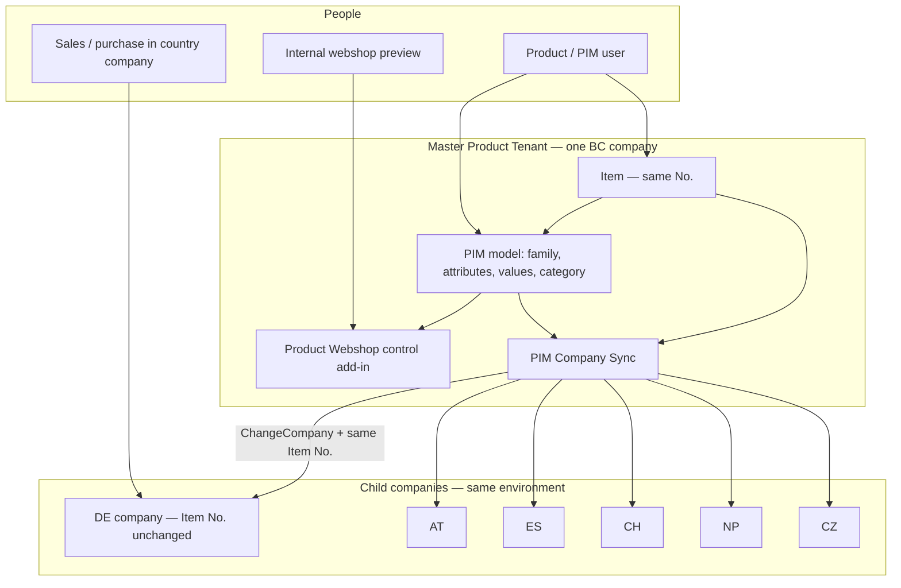
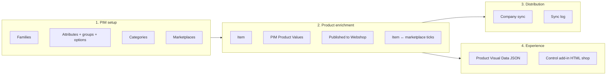
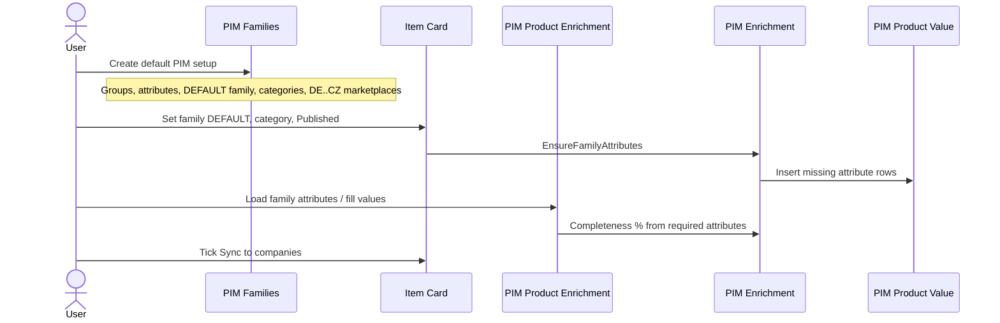
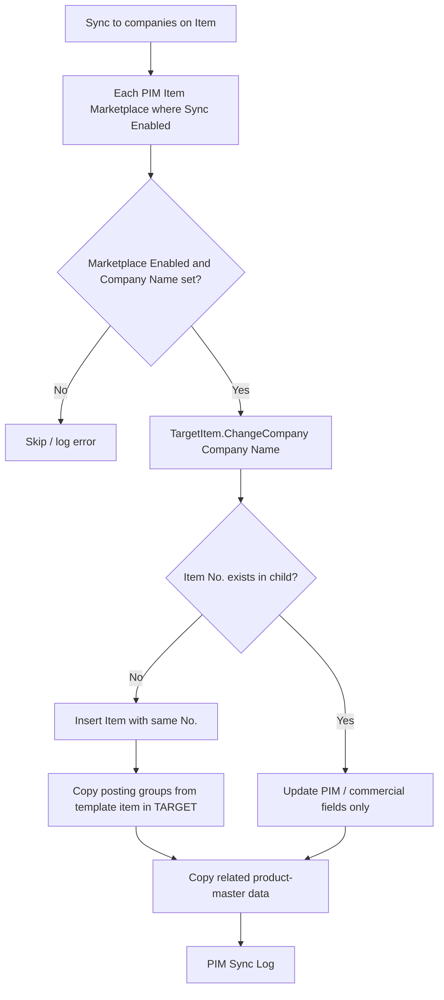
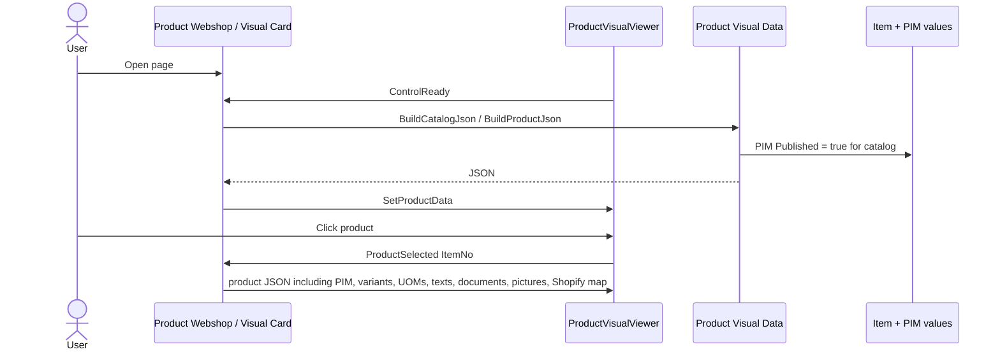
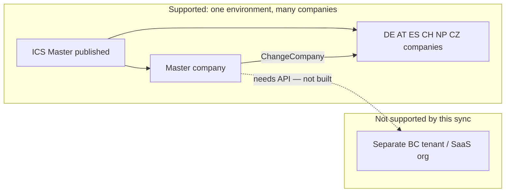

# PIM architecture for Business Central (ICS Master)

**App:** ICS Master (publisher ZVG)  
**Pattern:** Akeneo-style product information management **inside** Dynamics 365 Business Central, plus a Shopify-style storefront control add-in.  
**Rule:** PIM enriches the **Item**. It does not replace the ERP Item Card, inventory, costing, or documents.

This document is the design of the `Webshop` package. Object IDs use ICS Master ranges **50350–50399** and **50600–50700**.

---

## 1. Purpose

| Need | Design choice |
|------|----------------|
| One product number for sales and purchase in every country | **Same Item No.** in master and in DE / AT / ES / CH / NP / CZ |
| Rich commercial data (title, brand, SEO, options) without dumping the whole Item Card | Separate **PIM tables** + three fields on Item |
| Six operating companies | **PIM Marketplace** maps a code to an exact BC **Company Name**; sync uses `ChangeCompany` |
| Storefront that shows PIM, not ERP internals | **Product Webshop** control add-in reads JSON from `Product Visual Data` |
| Do not clash with PTE Marketplace Code / Master SKU | PIM uses its **own** marketplace list (DE, AT, ES, CH, NP, CZ) |

**Out of scope today:** separate tenants (API), live Shopify OAuth, inventory, unit cost, warehouse SKUs, sales/purchase documents.

---

## 2. Context — where PIM sits



Publish **the same ICS Master app** in every company you open. Sync copies **data**, not the extension.

If a country is a **different tenant**, `ChangeCompany` cannot reach it. That needs APIs (not built).

---

## 3. Logical layers



1. **Setup** is reference data (like Akeneo families / attributes). Seeded by **Create default PIM setup**.
2. **Enrichment** is per Item: family, category, attribute values, completeness %, publish flag, which countries get the item.
3. **Distribution** copies master product data into child companies. Template item in the **target** supplies posting groups on insert.
4. **Experience** is preview only: catalog of published items, product page with PIM + selected BC product-master fields.

---

## 4. Data model

```mermaid
erDiagram
    PIM_ATTRIBUTE_GROUP ||--o{ PIM_ATTRIBUTE : groups
    PIM_ATTRIBUTE ||--o{ PIM_ATTRIBUTE_OPTION : options
    PIM_ATTRIBUTE ||--o{ PIM_FAMILY_ATTRIBUTE : used_in
    PIM_FAMILY ||--o{ PIM_FAMILY_ATTRIBUTE : has
    PIM_CATEGORY ||--o{ PIM_CATEGORY : parent
    ITEM ||--o{ PIM_PRODUCT_VALUE : values
    PIM_ATTRIBUTE ||--o{ PIM_PRODUCT_VALUE : defines
    PIM_FAMILY ||--o{ ITEM : "PIM Family Code"
    PIM_CATEGORY ||--o{ ITEM : "PIM Category Code"
    ITEM ||--o{ PIM_ITEM_MARKETPLACE : assigned
    PIM_MARKETPLACE ||--o{ PIM_ITEM_MARKETPLACE : target
    PIM_MARKETPLACE ||--o{ PIM_SYNC_LOG : logs
    ITEM ||--o{ PIM_SYNC_LOG : logs

    PIM_ATTRIBUTE_GROUP {
        Code PK
        Description
        SortOrder
    }
    PIM_ATTRIBUTE {
        Code PK
        Caption
        Type
        GroupCode FK
        ShopifyField
    }
    PIM_ATTRIBUTE_OPTION {
        AttributeCode PK
        Code PK
        Caption
    }
    PIM_FAMILY {
        Code PK
        Description
    }
    PIM_FAMILY_ATTRIBUTE {
        FamilyCode PK
        AttributeCode PK
        Required
    }
    PIM_CATEGORY {
        Code PK
        ParentCode FK
        Description
    }
    ITEM {
        No PK
        PIMFamilyCode
        PIMCategoryCode
        PIMPublished
    }
    PIM_PRODUCT_VALUE {
        ItemNo PK
        AttributeCode PK
        Value
    }
    PIM_MARKETPLACE {
        Code PK
        CompanyName
        Enabled
        TemplateItemNo
        CopyUnitPrice
        CopyPostingGroups
    }
    PIM_ITEM_MARKETPLACE {
        ItemNo PK
        MarketplaceCode PK
        SyncEnabled
        LastSyncStatus
    }
    PIM_SYNC_LOG {
        EntryNo PK
        ItemNo
        MarketplaceCode
        Status
        Message
    }
```

### Akeneo mapping

| Akeneo | This design |
|--------|-------------|
| Family | `PIM Family` + `PIM Family Attribute` (required flags) |
| Attribute group | `PIM Attribute Group` |
| Attribute | `PIM Attribute` (Text, Number, Yes/No, Option, Date) |
| Attribute options | `PIM Attribute Option` |
| Category tree | `PIM Category` with parent |
| Product values | `PIM Product Value` keyed by Item No. + Attribute |
| Completeness | Required family attributes filled / required × 100 |
| Channel / locale | Marketplace = **BC company** (not a Shopify sales channel yet) |
| Shopify field names | Optional `Shopify Field` on the attribute (title, vendor, body_html, metafields.*) |

### Item extension (only three fields)

`tableextension 50607 PIM Item Ext`:

- `PIM Family Code` — on validate, creates empty value rows for the family  
- `PIM Category Code`  
- `PIM Published` — catalog filter for the webshop  

PTE **Marketplace Code** and **Master SKU** are not used and not overwritten.

---

## 5. Object map (ICS Master)

| Layer | Objects |
|-------|---------|
| Model | enum 50600; tables 50600–50606, 50636–50638; tableext 50607 |
| Setup UI | pages 50610–50617, 50640 |
| Enrichment UI | pages 50618–50619; Item Card/List ext 50353–50354 |
| Sync | codeunit 50639; pages 50641–50642 |
| Webshop | pages 50351–50352; codeunit 50633; control add-in `ProductVisualViewer` |
| Lifecycle | install 50634; upgrade 50635; permission set 50355 |
| Assets | `src/Webshop/scripts/*.js`, `src/Webshop/styles/productViewer.css` (paths relative to `app.json`) |

Control add-in scripts/CSS are **not** relative to the `.al` file. If `Webshop` lives under `src`, paths must be `src/Webshop/...`.

---

## 6. Enrichment flow



Default seed (install + **Create default PIM setup**): groups IDENT / MARKETING / SPECS / SEO; attributes title, brand, descriptions, color, material, size, SEO; family `DEFAULT`; categories MASTER / CARE / MEDICAL; marketplaces DE, AT, ES, CH, NP, CZ.

---

## 7. Company sync flow



**Same Item No.** is mandatory. The template item is never used as the number.

### Copied (product master)

Description, search description, GTIN, tariff, origin, weights, sales/purch UOM, item category, PIM family/category/published, PIM values, item picture, variants, item UOMs, translations, extended text header+lines, item references, document attachments (media and URL/URI), standard Item Attributes **matched by name** (IDs are local to each company). Optional: unit price, posting groups from master.

### Never copied

Inventory, unit cost, sales/purchase documents, warehouse SKUs, full `TransferFields` of Item.

Child companies still own local ERP: vendors, posting, stock, prices unless you opt into unit price copy.

---

## 8. Webshop (preview, not a public store)



Catalog JSON is capped (48 items). Product JSON is storefront-shaped: header, PIM attributes, BC item attributes, Shopify field map, variants, UOMs, translations, extended texts, documents, pictures.

This is an **internal** BC page with a control add-in. It is not a customer-facing website and does not call Shopify.

---

## 9. Tenancy and deployment



| Topic | Decision |
|-------|----------|
| App | One extension (ICS Master), folder `Webshop` / `src/Webshop` |
| Companies | Marketplace **Company Name** must match `Company.Name` exactly |
| Permissions | Assignable set **PIM and Webshop** (50355) |
| PTE | No overlap with PTE marketplace/SKU fields |

---

## 10. Tell Me pages (after publish)

| Search | Use |
|--------|-----|
| PIM Families | Seed setup; maintain families |
| PIM Attributes / Attribute Groups / Categories | Reference data |
| PIM Marketplaces | Company names, template item, sync setup |
| PIM Product Enrichment | Per-item values + completeness |
| PIM Sync Log | Success / error per item and marketplace |
| Product Webshop | Catalog of **Published** items |
| Item Card | PIM FastTab, Sync to companies, View in Webshop |

---

## 11. Design principles (do not break)

1. **Item No. is the identity** across countries.  
2. **PIM is additive.** ERP posting, inventory, and documents stay on standard Item.  
3. **Master writes commercial truth;** children receive a copy. Children do not sync back in this version.  
4. **Webshop reads PIM + selected product-master fields**, not the full Item Card.  
5. **Unpublished items are invisible** in the catalog.  
6. **IDs of standard Item Attributes are not copied**; match by **Name** in the child.

---

## 12. Later extensions (not in this package)

- REST/OData sync if countries are separate tenants  
- Locale-specific PIM values (language per marketplace)  
- Push to Shopify Admin API using `Shopify Field`  
- Workflow / approval before publish  
- More than 48 catalog items / paging  

Use this file as the architecture baseline when changing tables, sync, or the control add-in.
